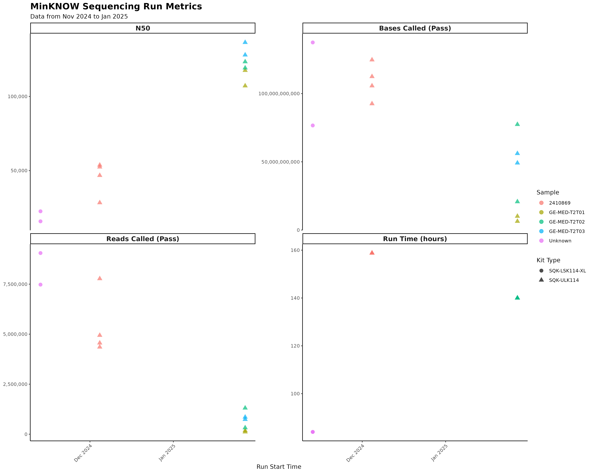
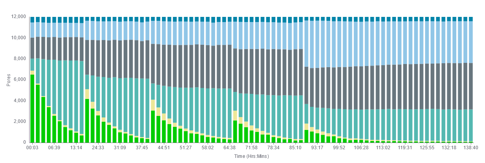
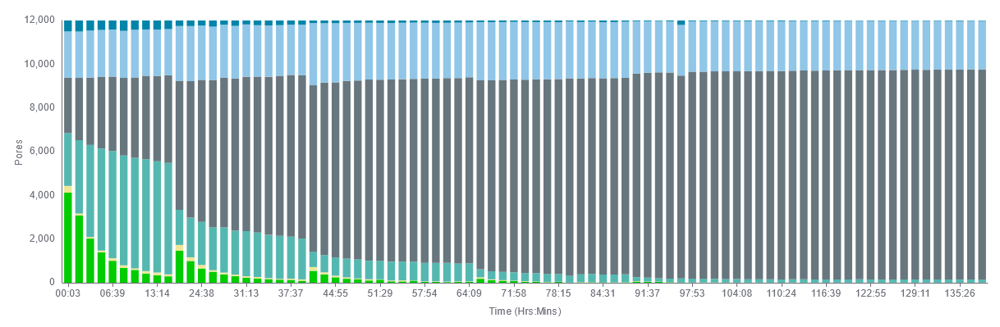
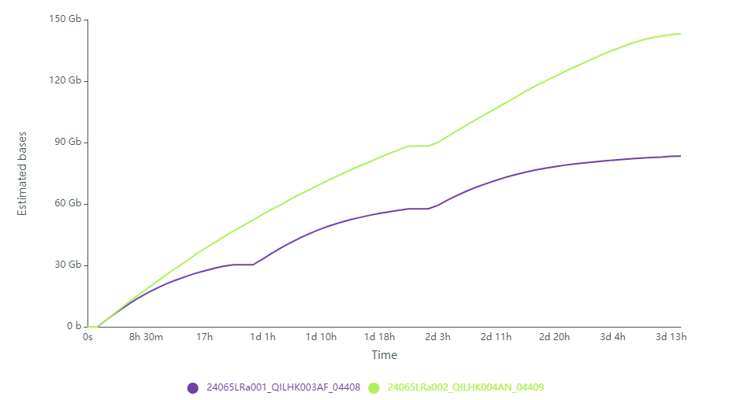

# Data QC

Collection of ReadQC, helping the establishment of UL, Duplex and PoreC. Also contains comparison of our seq data to public with public datasets.

## Ultra Long ONT Reads

Collection of observations for our sequencing batches.

### Batch 01:
2 Flowcells (1 sample). Different isolations
24070_1422_ultra-long
2024-11-11

### Batch 02:
4 Flowcells (1 sample), Different isolations.
NGSD Project: 24070_1422_ultra-long
2024-12-04

### Batch 03:
6 Flowcells
3 Samples (2 replicates)
NGSD Project: 25006_1422_BEGIN_T2T_GoE
2025-01-27

- N50 has approximately doubled (Good!)
- Output has halved and increased in variance
- 3 Flowcells have very low output, the other 3 are moderate.



Lets compare Pore Occupancy for the best (80GB) and a bad (16GB) flowcell: 



Already from the start, only 1/3 of pores are available. The number of blocked/saturated pores is high and also increases fast. 

Possible reasons for this:

- Could be overloaded. Saturation is high, together with extremely long fragmenmts could lead to blocked pores. Related forum post: https://community.nanoporetech.com/posts/improving-sequencing-yield
- Contamination is also a possibility, especially because one sample performs poorly. 
- Defective flowcells are unlikely.

We can rule out:
- Low pore occupancy due to insufficient DNA (underloading)
- Mechanical loading problems (Bubbles) are unlikely since 


### UL Read QC

To copy run reports:
```
find /mnt/storage3/raw_data/MINERVA/25006 -name "report_*.html" -exec cp {} /mnt/storage3b/projects/no_ngsd/ahthapp1_T2T_ONT/doc/run_reports/ \;
```

Merge reports:
```
python workflow/scripts/09_parse_minknow_reports.py doc/run_reports/
```

Create plots:
```
Rscript workflow/scripts/10_plot_minknow_reports.R doc/run_reports/run_summary.csv doc/tables/flowcell_biological_sample.tsv doc/img/
```

## Comparison with Public Data (UL)

In this document we compare our first UL libraries with published UL dataset

### Characteristics of the UL dataset from Koren et al (2024)

Sequencing was done in 2022 on R9.41, data comes from 8 separate Flowcells. Looking at the read length distribution the dataset available for download seems to be prefiltered since it does not contain shorter reads. However we found no information about the filtering tresholds and parameters.

### Comparison dataset overview

Overview of the first two flowcells we sequenced. This is unprocessed reads for our two flowcells and data "as downloaded" from Koren et al 2024.


| filename     | yield        | N50   | max readlen | yield>100kb | yield>200kb | reads > 1Mb |
| :----------- | :----------- | :---- | :---------- | :---------- | :---------- | :---------- |
| published.UL | 496106934638 | 81748 | 1.9 Mb      | 190 Gb      | 31 Gb       | 45          |
| run_04399.UL | 113914796731 | 67652 | 1.7 Mb      | 38 Gb       | 10 Gb       | 29          |
| run_04400.UL | 107609849976 | 77925 | 2.0 Mb      | 40 Gb       | 9 Gb        | 54          |


### Evaluation first UL sequencing runs.

Looking at the sequencing performance over time we see a high and steady output over the whole runtime. 


Our sequencing yield is good, we can assume that it is higher then the published dataset where 8 Flowcells were combined to reach 500Gb after filtering leading to an average of 62.5Gb/Flowcell. We reached 230Gb with two flowcells, however before filtering.

### Read length and quality distribution


#### Not filtered:


Mean read quality is substantially better with the new R10 pores, the variance is broader with some low quality reads. This observations could stem from some pre filtering of the published dataset. 
Read length distribution of our UL reads is shifted slightly to slightly lower reads, reflected by 

There is no clear difference in read or quality length distribution between our two runs, the extraction methods seem to perform very similar. 

#### After filtering to 50x coverage: 


We need at least 50x long read coverage, equal to 160Gb, of UL reads.  Our testing grid in [Assembly QC](04_assembly_qc.md) showed that 50x shows similar performance to 70x recommended in published studies. 

| filename         | yield | N50    | max readlen | yield>100kb | yield>200kb | reads > 1Mb |
| :--------------- | :---- | :----- | :---------- | :---------- | :---------- | :---------- |
| TUE_01.UL.50x    | 160GB | 97739  | 2037kb      | 78GB        | 18GB        | 50          |
| published.UL.50x | 160GB | 129072 | 1511kb      | 121GB       | 22GB        | 39          |

After filtering our N50 and number of reads > 100kb is substantially worse then the published dataset.

### Estimation of flowcells needed per sample for T2T-Assembly

We need either 2 or 3 good performing UL Flowcells. Influenced by these factors:

- When the good performance of pilot flowcells is consistent and we could push our output to 200GB with 2 flowcells, sequencing two flowcells should be enough.
- For fluctiations in flowcell performance we should reserve additionals flowcells for a third FC per sample.
- It is possible that we will observe a need for a third flowcell (target yield 250GB) UL reads to close gaps in more difficult centromeric/telomeric regions. 
- It is likely that we can use long simplex >100kb reads from the Duplex/Herro sequencing to add some data to our coverage. However this will not provide the required Ultralong reads. 

### Downsampling strategy

To benchmark required read depths to generate T2T assemblies we downsampled the published dataset from Koren et al. To do this we used a subsampling process using `filtlong`, preferring high quality and longer reads. We then mapped the assembly input files and calculat the mapping coverages to check if the subsampling was successful:


Plotting the mapping coverages confirms that we reach the target coverages for all input datasets.

