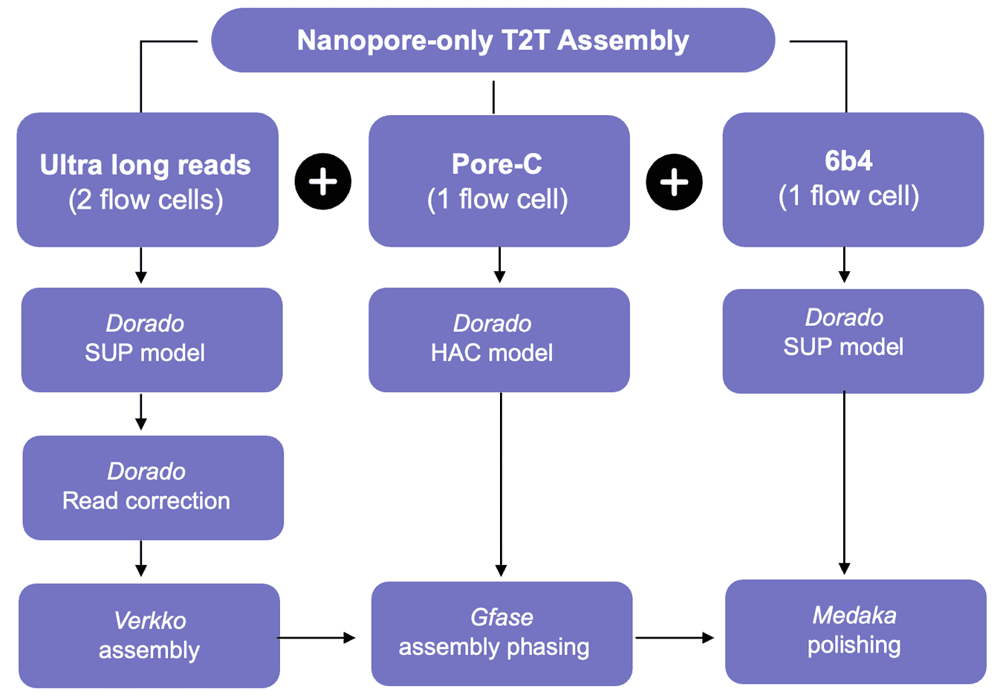

# Assembly QC
Documentation of used QC parameters. Comparison of different assembly and scaffolding methods.

## Collapsed misassemblies

Implemented in this pipeline: paftools asmgene. 
Output described in a [blog post](https://lh3.github.io/2020/12/25/evaluating-assembly-quality-with-asmgene) by Heng Li

MMC = Missing multi copy genes

## Pipeline description Nanopore ONT

## Strategies described for assembly polishing:

https://github.com/arangrhie/T2T-Polish/tree/master

## Source 

How to use GFAse with Verkko:

Homopolymer compressed graph needs to be decompressed. 
- `12_uncompress.py`: [GitHub](https://raw.githubusercontent.com/skoren/verkkohic/refs/heads/master/uncompress.sh) S. Koren ([Discussion](https://github.com/marbl/verkko/issues/302#issuecomment-2485843127)) 

We still need to compare the performance of GFAse scaffolding compared to verkko only. 

## Assembly Metrics

### Missassemblies/Collapsed regions
asmgene

### 

### Base quality
Questions do we want to sequence one reference sample (HG002?) to estimate the base error rate?

> Base quality was estimated using yak41, based on the k-mer content of Illumina short reads. Each phased assembly was evaluated separately. K-mer in the short reads were counted using “yak count -b 37”, and quality values (QV) were estimated using “yak qv -K 3.2g -l 100k”. For HG002, we used the 30x Illumina Novaseq PCR-free read set publically available at the Google bucket gs://deepvariant/benchmarking/fastq/wgs_pcr_free/30x/. For the 4 samples from the HPRC (HG01993, HG02132, HG02647, and HG03669), we used 30x Illumina short-reads from the high coverage readset of the 1000 Genomes Project samples (Lorig-Roach et al. 2023)