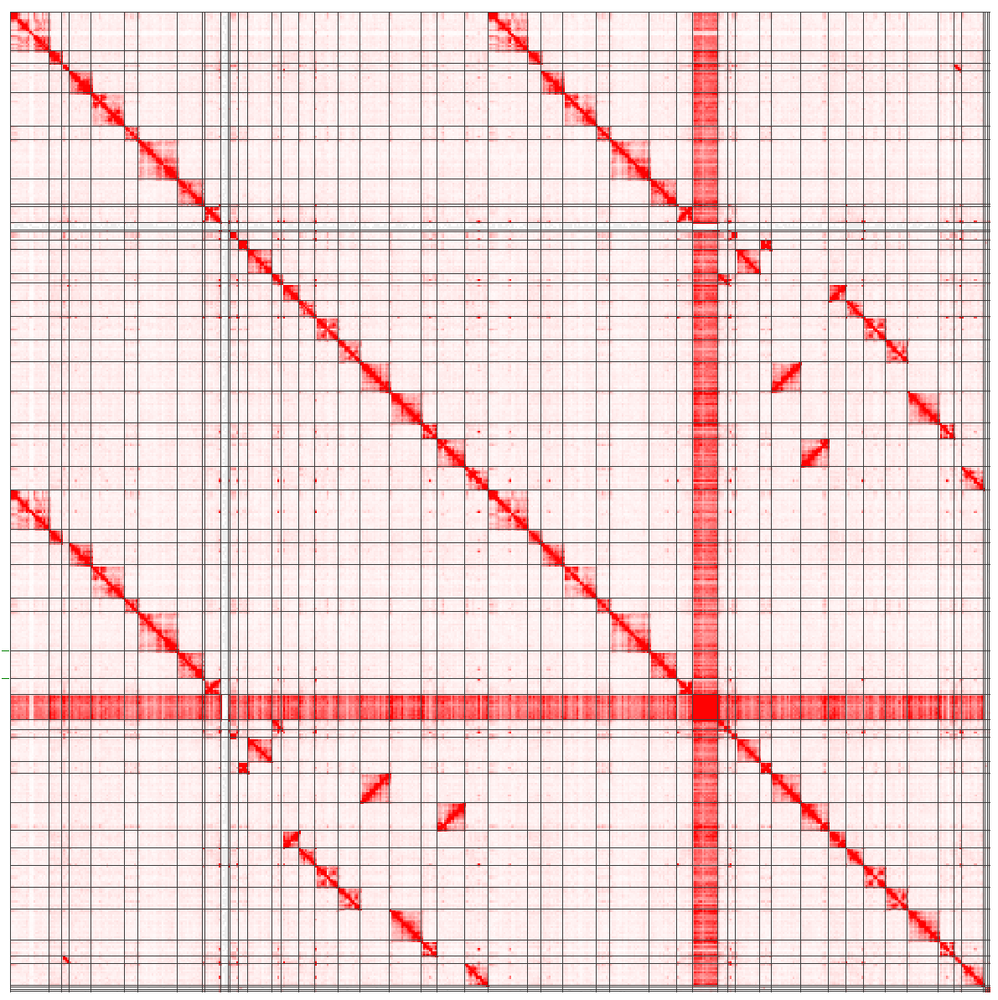

# TAD Analysis

## Use wf-pore-c agains diploid assembly

We want to assign the PoreC to the individual haplotypes, for this we use the wf-pore-c pipeline and use our diploid assembly as reference.

### 1) First Try

17.06.2025, Default settings

Error in mosdepth step: 
ERROR: start > end in bed line:unassigned-0000195 102258 102257

Maybe this could simply be resolved by removing all very short contigs from the assembly.

Observations 
- Associations between haplotypes seems to be equally strong is inside the same haplotype --> Haplotype separation seems to be not working
- Haplotype-0000056 is chromosome X, and almost every other chromosome has strong interactions with it. This does not happen in the GRCh38 aligned dataset.

Information from source code

pore_c_py/annotate.py should only consider primary alignments. The final bamfile also contains only primary alignments. 

### Output files
    .cs.bam : Coordinate sorted bam
    .bs.bam : Name sorted bam

Idea: If a phased VCF is provided ,the output BAM will be haplotagged using Whatshap.

## Doc

**TAD (Topologically Associating Domains) Calling:**

- TADs are large genomic regions (typically 100kb-1Mb) where DNA sequences interact more frequently with each other than with sequences outside the domain
- TADs represent stable chromatin organization units that are conserved across cell types
- Used for: understanding chromatin architecture, gene regulation domains, structural variants analysis
- Method: Uses insulation score calculations to identify domain boundaries

**Loop Calling:**
- Loops are specific point-to-point contacts between distant genomic loci (e.g., enhancer-promoter interactions)
- Represent dynamic, often tissue-specific regulatory interactions
- Used for: identifying regulatory elements, enhancer-promoter pairs, CTCF-mediated loops
- Method: Identifies statistically significant peak interactions above local background

