### Important Resources
- Koren et al. 2024: Gapless assembly of complete human and plant chromosomes using only nanopore sequencing (**Verkko**)
- Šikić et al. 2024: Telomere-to-telomere phased genome assembly using error-corrected Simplex nanopore reads (**Herro**)
- Li and Durbin 2024: Genome assembly in the telomere-to-telomere era (**Review**)
- ONT T2T Assembly Blogpost : https://community.nanoporetech.com/t/ont-t2t-assembly-blogpost/10166

--- 

### Nanopore Read Types
- **Simplex**: Default ONT reads, LSK Library (R10.3)
- **Duplex**: Simplex reads, but with duplex chemistry (R10.3)
- **Herro**: Simplex or UL reads, corrected with ML algorithm (R10.3)
- **UL**: Special Library Prep, focus on max read length (R10.4)
- **PoreC**: Chromatin association
- **Polishing Kit**: Simplex reads, but with Polishing Kit chemistry 

--- 

### Public Datasets

Giab Sample **HG002** From Koren et al (2024): 
- 15 FC Simplex R10
- Duplex reads called from simplex reads 
- 8 FC R9.4 UltraLong
- PoreC

--- 

### Published Pipelines
- ONT Recommended (Verkko with Herro)

- Verkko with Duplex (Koren et al. 2024)

--- 
 

### Benchmarking with published data

Run on reduced dataset: Filtered on chr19

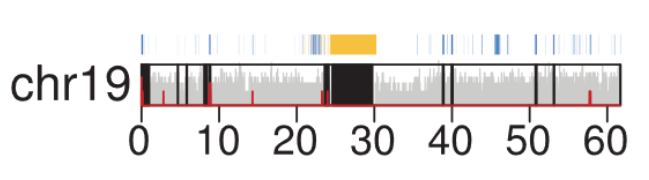

- *"Easy"* chromosome
- Fast computation

--- 

### Benchmark Comparison Matrix
```
 LR↓/UL→ |         50x         |      70x     |     90x      |
         +---------------------+--------------+--------------+
     15x |     duplex          |       --     |      --      |
     20x |     duplex          |       --     |      --      |
     25x |     duplex          |       --     |      --      |
     35x | 15x DU + 20x herro  |       --     |      --      |
     35x | duplex/herro        | duplex/herro | duplex/herro |
     60x |     herro           |     herro    |    herro     |
    120x |     herro           |     herro    |    herro     |
```
---


1. Filtering on fastq. Do we reach target coverage? 

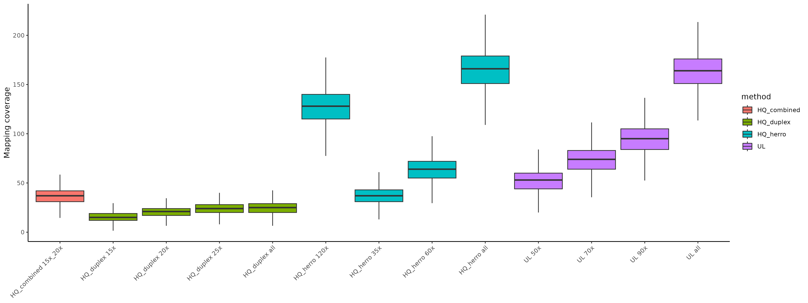


---
 

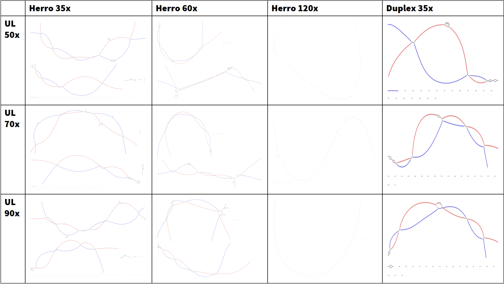

---

Left Duplex 15x, Right Duplex 20x, chr19

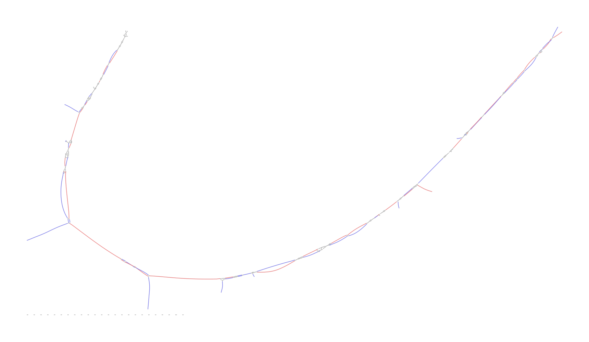
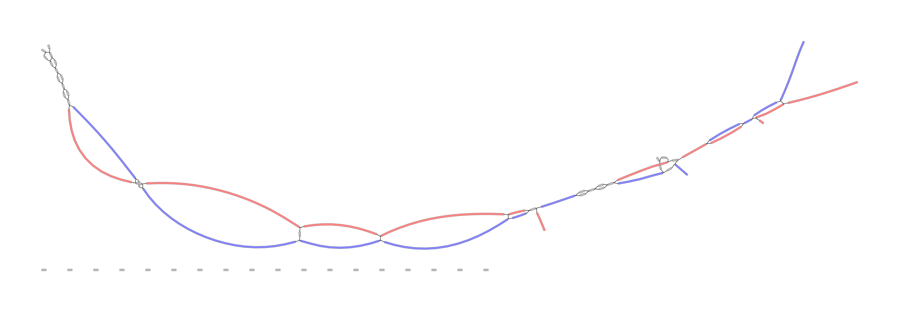

---

### Key points:

- High coverages do not increase quality
- 35x HQ and 50x UL is optimal
- Low cov Duplex still ok

---

herro vs duplex

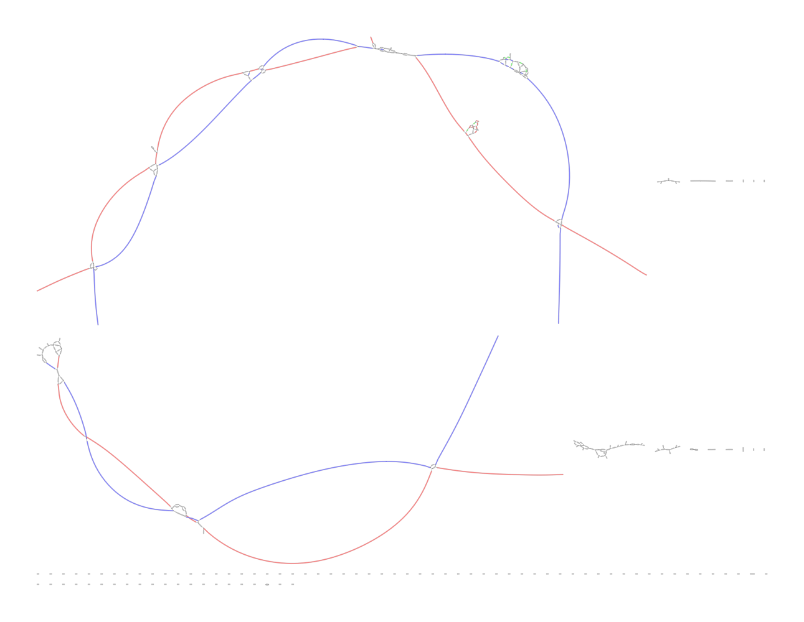
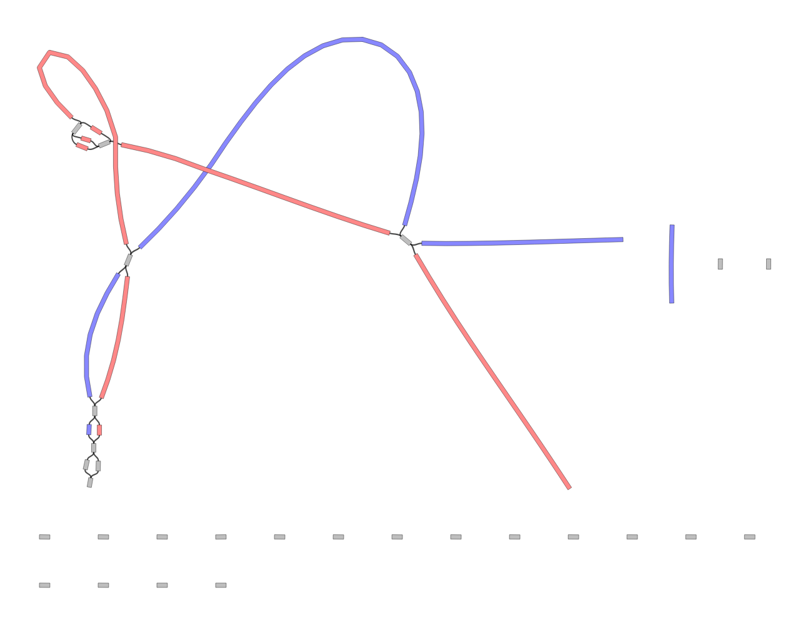

---

duplex, verkko, full

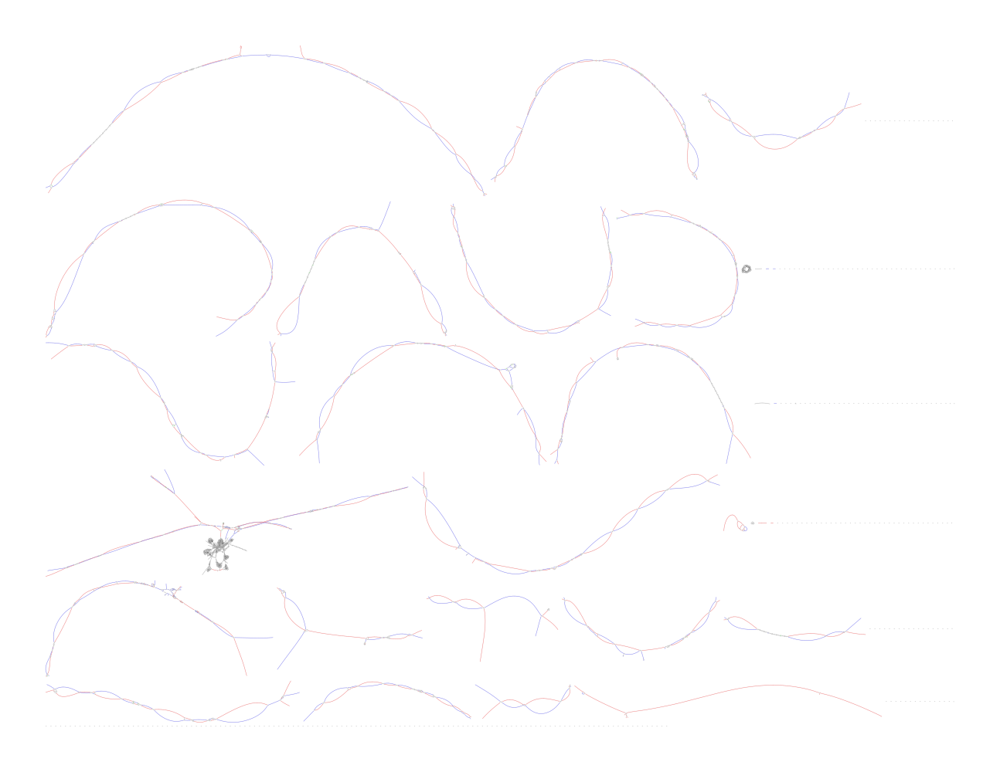

---

### Completed T2T ?
no postprocessing, T2T detection with script, looking for TTAGGG

Duplex, UL70x, Verkko
Haplotype1: **16** chromosomes T2T
Haplotype2: **14** chromosomes T2T

Duplex, UL70x, Gfase
Haplotype1: **8** chromosomes T2T
Haplotype2: **0** chromosomes T2T

---  

Our data: UL

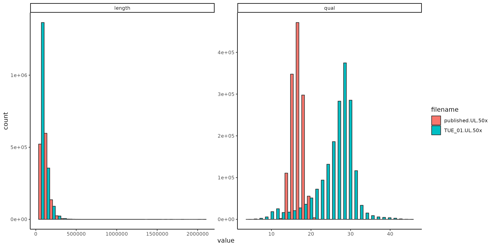

---
### Our Data: Ultra-Long

<style scoped>
table {
  font-size: 24px;
}
</style>

Overview of the first two flowcells we sequenced. 
Our data is unprocessed, published data "as downloaded" 


| filename     | yield        | N50   | max readlen | yield>100kb | yield>200kb | reads > 1Mb |
| :----------- | :----------- | :---- | :---------- | :---------- | :---------- | :---------- |
| published.UL | 496Gb | 81748 | 1.9 Mb      | 190 Gb      | 31 Gb       | 45          |
| run_04399.UL | 114Gb | 67652 | 1.7 Mb      | 38 Gb       | 10 Gb       | 29          |
| run_04400.UL | 108Gb | 77925 | 2.0 Mb      | 40 Gb       | 9 Gb        | 54          |

Published data from 8 FC

---

Unfiltered 
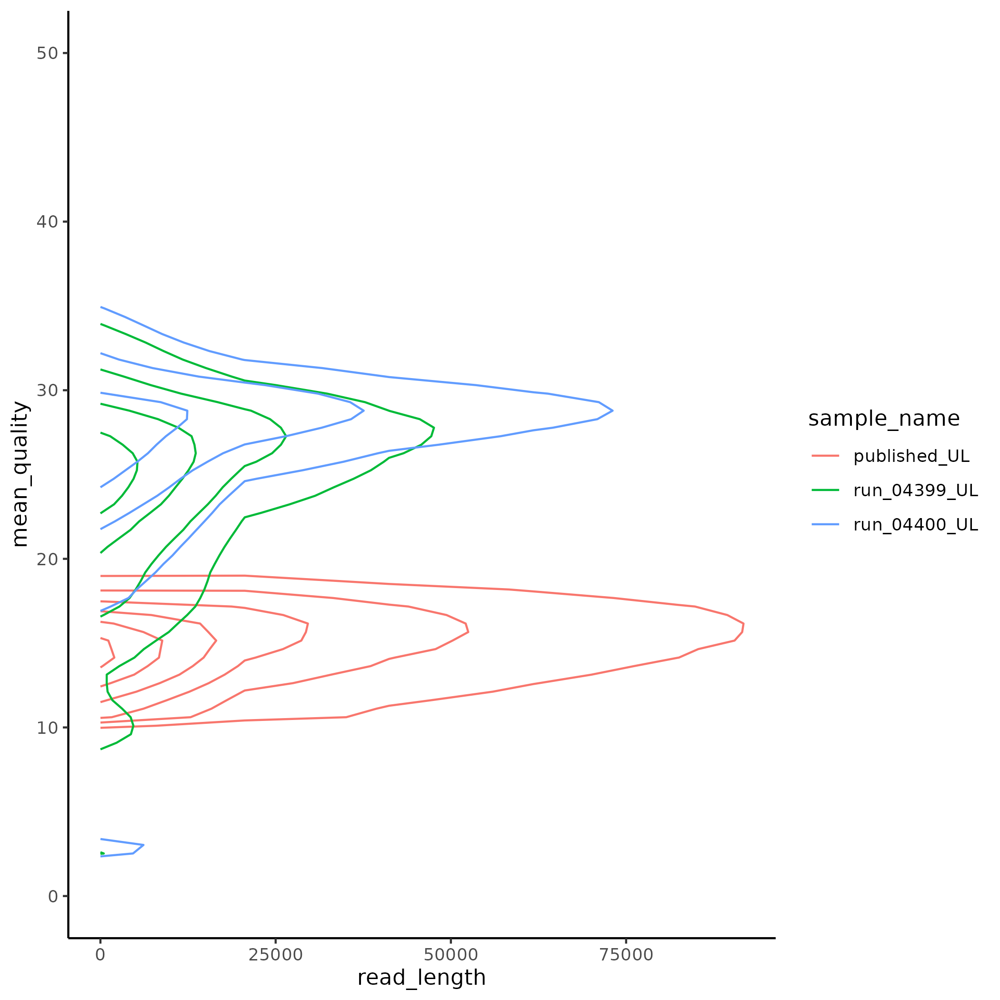
Filtered to 50x coverage
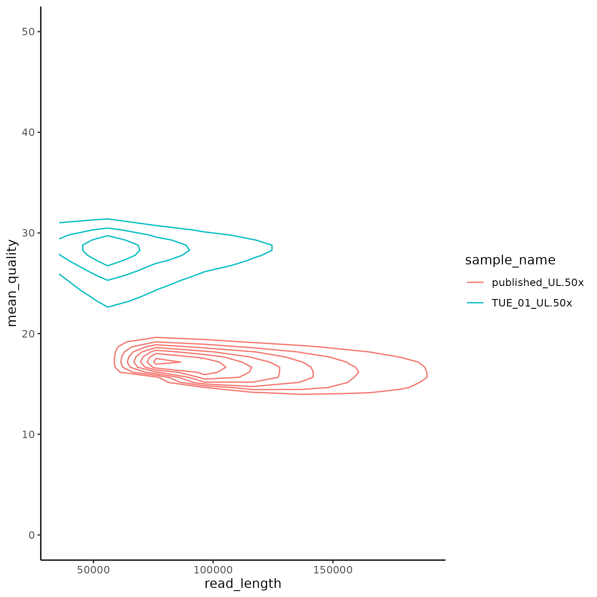


---
<style scoped>
table {
  font-size: 24px;
}
</style>

### After filtering:

| filename         | yield | N50    | max readlen | yield>100kb | yield>200kb | reads > 1Mb |
| :--------------- | :---- | :----- | :---------- | :---------- | :---------- | :---------- |
| TUE_01.UL.50x    | 160GB | 97739  | 2037kb      | 78GB        | 18GB        | 50          |
| published.UL.50x | 160GB | 129072 | 1511kb      | 121GB       | 22GB        | 39          |


Target coverage can be reached with 2 good FC.
Additional reads for better read filtering are preferred.

4 additional FC with similar performance in analysis.

---

## Our data: Duplex

| Sample      | Project  | Type   | Duplex Rate | Duplex Yield |
| :---------- | :------- | :----- | :---------- | :----------- |
| 23074LRa001 | MYGENOME | LSK114 | 0.27        | 10Gb         |
| 23074LRa003 | MYGENOME | LSK114 | 0.26        | 10Gb         |
| 24070LRa003 | UL test  | ULK114 | 0.01        | 0.6Gb        |
| 24070LRa010 | UL test  | ULK114 | 0.02        | 0.9Gb        |

Without Duplex optimizing. Published data reached ~15Gb / FC

---

## Combine Herro and Duplex.

Inital results look good for 15x Duplex + 20x Herro

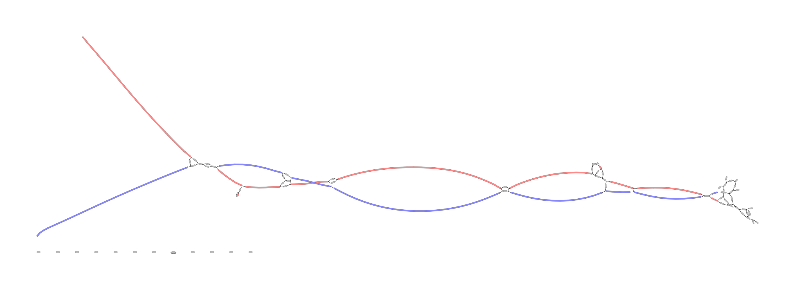

---
## Discussion points
T2T requirement discussions:
- Genome completeness
    - How many T2T chromsomes do we need? 
- Planned number of Flowcells 
    - 2 or 3 UL ?
    - At least 45 GB Duplex (15x) --> 4 - 5 FC
    - 1  PoreC
    - 1 Polishing?

--- 
## Discussion points
- Lab Establishment Priorities
    - UL  : finished?
    - Duplex : required?
    - PoreC 
    - Polishing Kit
- Bioinformatics Implementations
    - Downstream analysis of Genomes
    - Sequence HG002 for Benchmark?