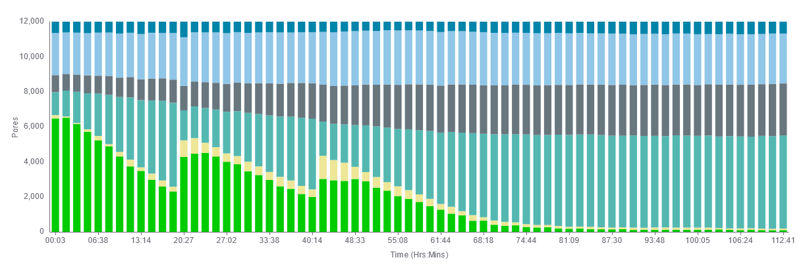

---

 Batch2, 96Gb
 Batch3, T202, 80Gb 
 Batch3, T201, 12Gb
Pores getting blocked very quickly (grey)

---

*Possible explanations*:
- Contamination (Salts, ...)
- Heavy Overloading 

*Unlikely reasons*:
- Underloading
- DNA problems

The three low performing samples were isolated on the same day. 

--- 

Olafs Genome

---

## Other tests: Use verkko polishing?

--- 

## Other tests: 