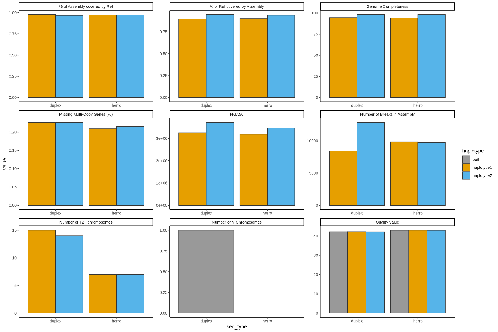
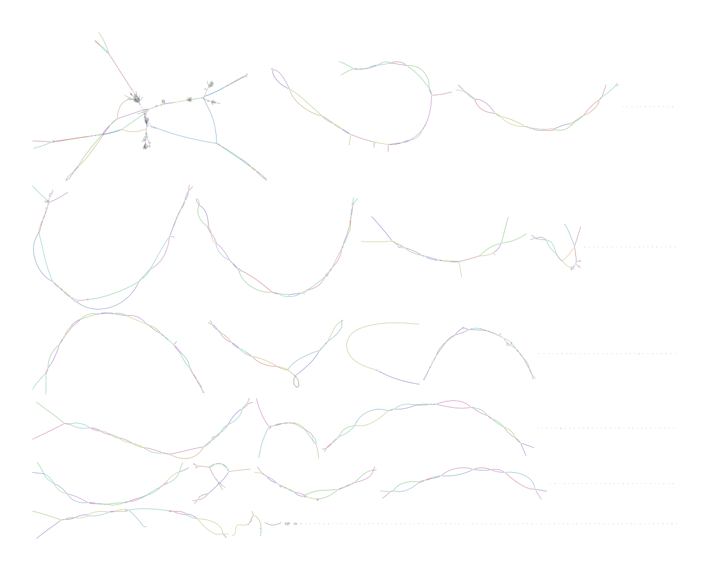

---

 Batch2, 96Gb
 Batch3, T202, 80Gb 
 Batch3, T201, 12Gb
Pores getting blocked very quickly (grey)

---

*Possible explanations*:
- Contamination (Salts, ...)
- Heavy Overloading 

*Unlikely reasons*:
- Underloading
- DNA problems

The three low performing samples were isolated on the same day. 

---
Herro vs published

--- 

### Our first genome

- 50x UL
- ~20x Duplex + 20x Herro
- Error rate 0.05%
- NG50: 27Mb
- Rcov: 96.18%
- Rdup: 91.58%
- #breaks: 24924
- T2T haplotypes: 0

---

## Other tests: Use verkko polishing step?

- No impact

--- 

## Next steps:

- Annotate assembly graph
- Add methylation
- Further try out assembly with herro reads (Filter length)
- Try novel assembly approach (A. DiGenova)
