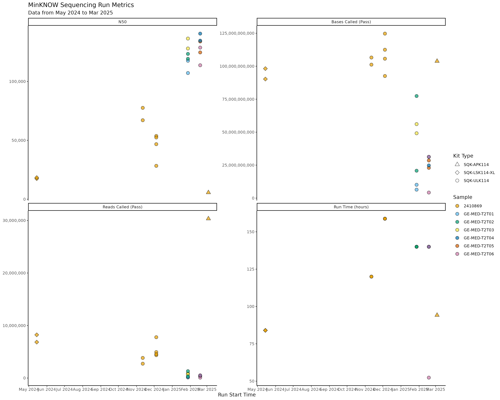
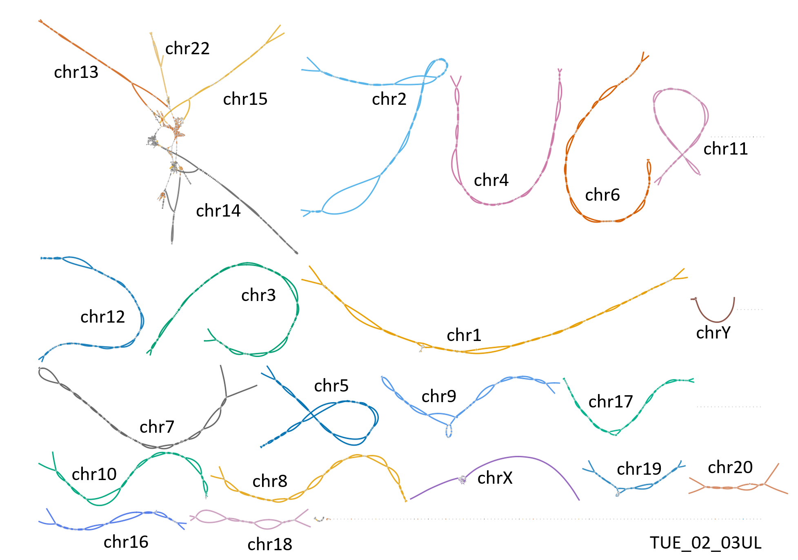

## Sequencing updates T2T

- 1st APK Flowcell finished
- Should focus on completing Trio (Parents) for first sample. Normal LSK is enough.
- Need to improve throughput

---

## Pipeline updates

- Assembly graph with chromosome colours

---

## Pipeline updates

- APK Polishing integrated

--- 

## APK accuracy improvements

TUE02 compared against HG002 GIAB

|            | assembly bp (diploid) | QV    | Error rate |
| :--------- | :-------------------- | :---- | :--------- |
| unpolished | 6102521769            | 33.13 | 0.00049    |
| polished   | 6068356375            | 33.16 | 0.00048    |

No visible improvement in QV/Error rate might be caused by 
different samples HG002/TUE02 (SNVs expected). 

Runtime: 2.5 days on 40 Threads.

--- 

## Work in Progress

Assembly QC for following tests:

|               |               |               |               |               |               |
| :------------ | :------------ | :------------ | :------------ | :------------ | :------------ |
|✅ 1 UL 0 Duplex | ✅ 2 UL 0 Duplex | ✅ 3 UL 0 Duplex | ✅ 4 UL 0 Duplex | ✅ 5 UL 0 Duplex | ✅ 6 UL 0 Duplex |
| ✅ 1 UL 1 Duplex | ✅ 2 UL 1 Duplex | ✅ 3 UL 1 Duplex | ✅ 4 UL 1 Duplex | 5 UL 1 Duplex | 6 UL 1 Duplex |
| 1 UL 0 Duplex | 2 UL 0 Duplex | 3 UL 0 Duplex | 4 UL 0 Duplex | 5 UL 0 Duplex | 6 UL 0 Duplex |

