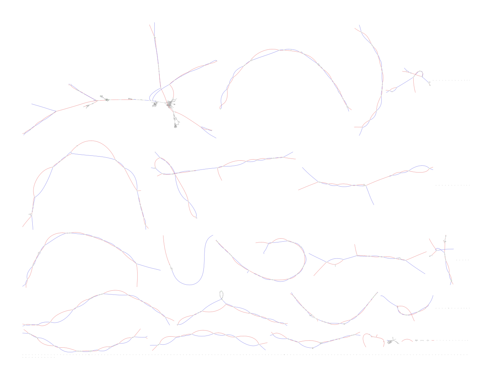

# Sequencing progress

- 1st PoreC sequenced

---

# APK Polishing 

Based on Illumina data now

| sample | errors | length | QV | Error rate |
| :---------------- | :------ | :--------- | :------ | :---------- |
| TUE_02          | 312523  | 6102544217 | 56. 1 | 2.4e-06 |
| TUE_02_polished | 1126433 | 6068379671 | 50.5 | 8.8e-06 |

according to this it got worse.
Need to talk to ONT about this

---

# PoreC

--- 

Phased genome
Draft vesion

