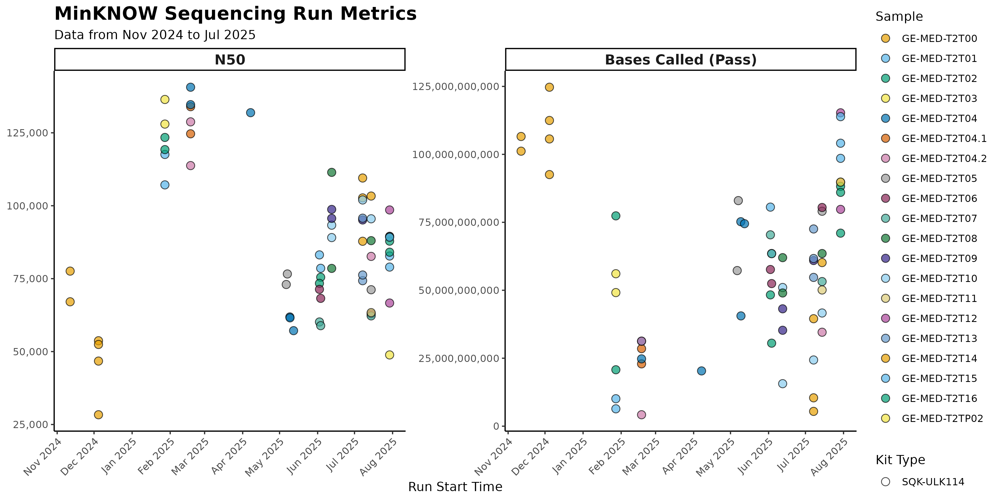

# IMGAG longread meeting

02.09.2025
status Update

---

### Sequencing progress

--- 

### Analysis progress

Assemblies, probably still running?

---

### Clinically relevant genes, dark genome

Highlight clinically relevant genes?

> facioscapulohumeral muscular dystrophy (FSHD) (55). This region includes FSHD region gene 1 (FRG1), FSHD region gene 2 (FRG2), and an intervening D4Z4 macrosatellite repeat containing the double homeobox 4 (DUX4) gene that has been implicated in the etiology of FSHD (56). Numerous duplications of this region throughout the genome have complicated past genetic analyses of FSHD (Nurk et al, 2022)

---

### Publication name

Comment from draft