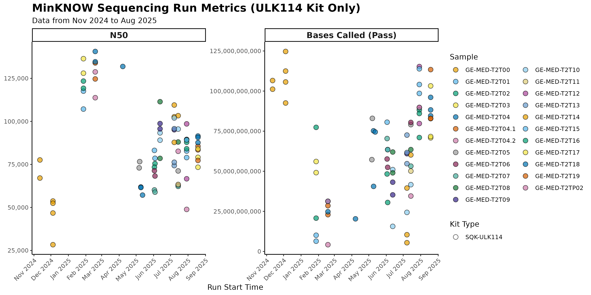

# IMGAG longread meeting

02.09.2025
status Update

---

---
Assembly progress

| Assembly | Status | UL Flowcells |
|----------|--------|-------------------|
| T2T00 | ✅ finished | 3 |
| T2T01 | ✅ finished | 4 |
| T2T02 | 🚀 started | 4 |
| T2T03 | 🚀 started | 3 |
| T2T04 | ✅ finished | 6 |
| T2T04_1 | 🚀 started | 5 |
| T2T04_2 | 🚀 started | 6 |
| T2T05 | 🚀 started | 3 |
| T2T06 | 🚀 started | 3 |
| T2T07 | 🚀 started | 3 |
| T2T08 | 🚀 started | 3 |
| T2T09 | 🚀 started | 3 |
| T2T10 | 🚀 started | 4 |
| T2T11 | 🚀 started | 3 |
| T2T12 | 🔄 basecalling | 3 |
| T2T13 | 🚀 started | 3 |
| T2T14 | 🔄 basecalling | 4 |
| T2T15 | 🔄 basecalling | 3 |
| T2T16 | 🔄 basecalling | 3 |
| T2T17 | 🔄 basecalling | 3 |
| T2T18 | 🔄 basecalling | 3 |
| T2T19 | 🔄 basecalling | 3 |

---
### Clinically relevant genes, dark genome

Highlight clinically relevant genes?

> facioscapulohumeral muscular dystrophy (FSHD) (55). This region includes FSHD region gene 1 (FRG1), FSHD region gene 2 (FRG2), and an intervening D4Z4 macrosatellite repeat containing the double homeobox 4 (DUX4) gene that has been implicated in the etiology of FSHD (56). Numerous duplications of this region throughout the genome have complicated past genetic analyses of FSHD (Nurk et al, 2022)

---

### Publication name

Comment from draft