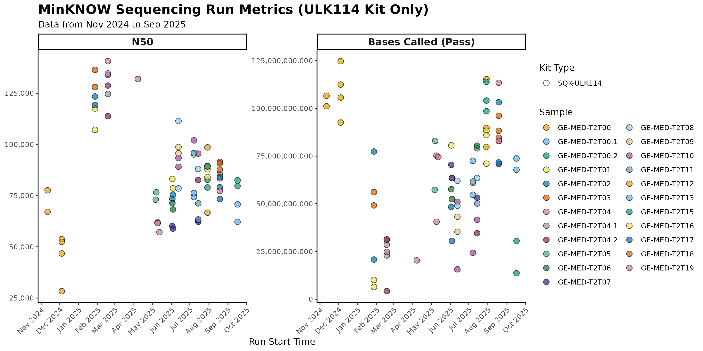
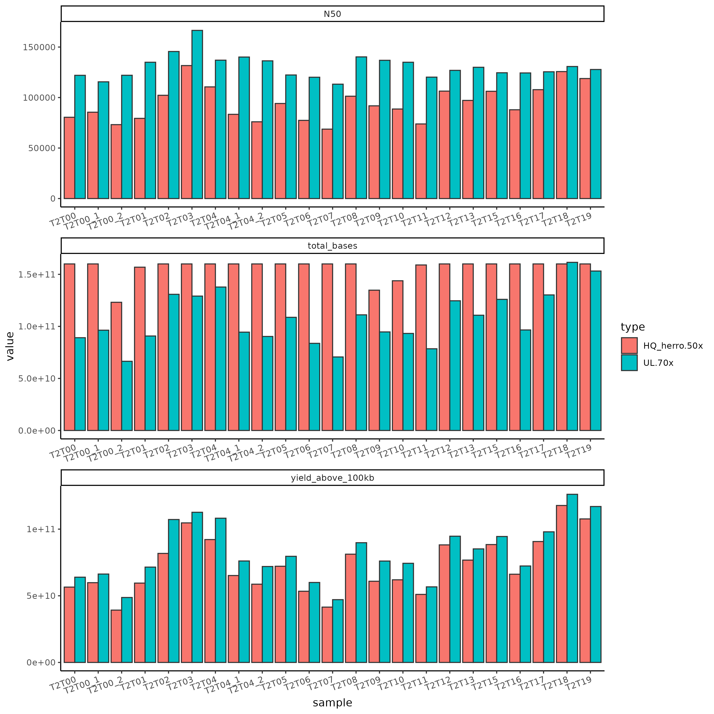
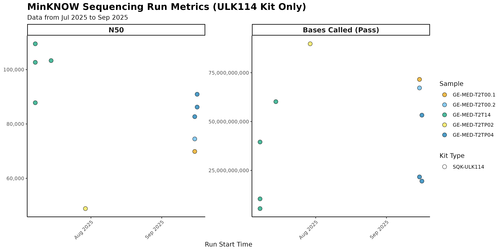
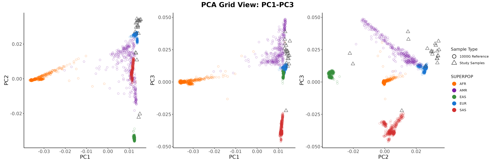
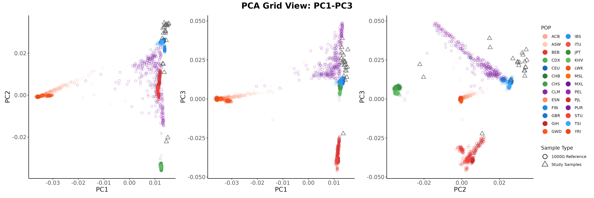
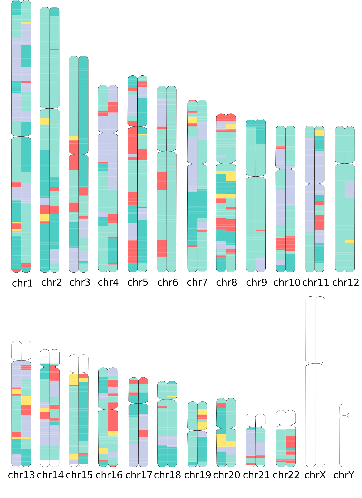
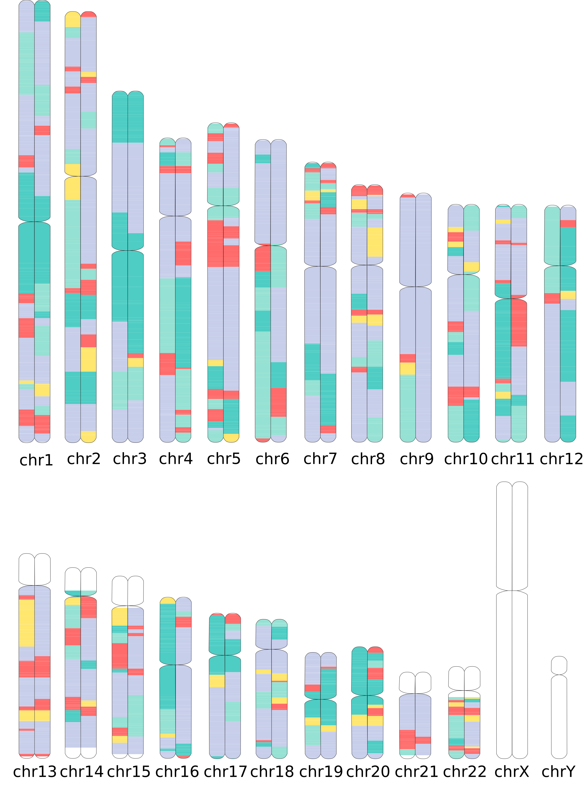
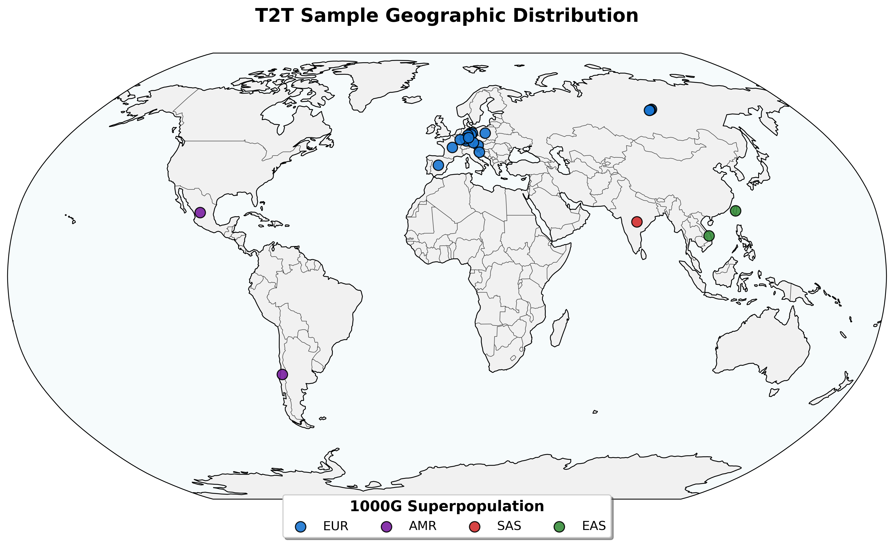

# IMGAG longread meeting

15.09.2025
status Update

---

---

| Assembly | Status | UL Flowcells |
|----------|--------|-------------------|
| T2T00 | ✅ finished | 3 |
| T2T00_1 | ✅ finished | 3 |
| T2T00_2 | ✅ finished | 3 |
| T2T01 | ✅ finished | 4 |
| T2T02 | ✅ finished | 4 |
| T2T03 | ✅ finished | 3 |
| T2T04 | ✅ finished | 6 |
| T2T04_1 | ✅ finished | 5 |
| T2T04_2 | ✅ finished | 6 |
| T2T05 | ✅ finished | 3 |
| T2T06 | ✅ finished | 3 |
| T2T07 | ✅ finished | 3 |
| T2T08 | ✅ finished | 3 |
| T2T09 | ✅ finished | 3 |
| T2T10 | ✅ finished | 4 |
| T2T11 | ✅ finished | 3 |
| T2T12 | ✅ finished | 3 |
| T2T13 | ✅ finished | 3 |
| T2T15 | ✅ finished | 3 |
| T2T16 | ✅ finished | 3 |
| T2T17 | ✅ finished | 3 |
| T2T18 | ✅ finished | 3 |
| T2T19 | ✅ finished | 3 |

---

---

---
## Data freeze

- No more sequencing required for publication ? T2T02? 
- New project for diagnostic samples:
`/mnt/storage3b/projects/no_ngsd/ahgrosc1_T2T_diagnositc`

---

### Global ancestry: PCA

---

### Global ancestry: PCA

---

|T2T01  |T2T08  |
| :---: | :---: |
|   |   |

    AFR:Red, AMR:Teal, EAS:Yellow, EUR:Mint, SAS:Lavender

--- 

